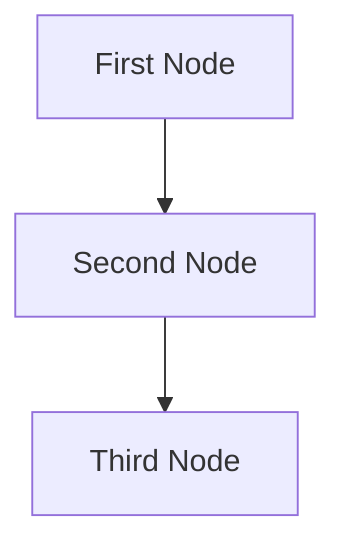

# Design Doc: Second Brain

> Please DON'T remove notes for AI

## Requirements

> Notes for AI: Keep it simple and clear.
> If the requirements are abstract, write concrete user stories

### Core Requirements

See [README.md](README.md)

### User stories

#### Adding memos
1. As a user, I want to get a list of memos extracted for a provided text so that I can review them.
2. As a user, I want to approve memos with one key press so they get added to the Second Brain immediately. After approving, I want to get the next memo for review.
3. As a user, I want to be able to restart the process at any time so that I can review the memos again. The process is restarted while keeping all approved memos and system instructions in the Second Brain.
4. As a user I want to provide feedback for a memo that I don't approve and get a revised memo along with revised system instruction memos for review.
5. As a user, I want to see the diff between the original and the revised memo so that I can understand the changes.

#### Retrieving memos
5. As a user, I want to get a combined text of memos based on a set of categories, and/or set of keywords, and/or similarity to a provided text so that I can get the relevant context.

#### Managing memos
6. As a user, I want to initiate a 'sleep' session and review the proposed changes one-by-one
7. As a user, I want to rebuild the vector store using the current memos, potentially with a different embedding model

## Flow Design

> Notes for AI:
> 1. Consider the design patterns of agent, map-reduce, rag, and workflow. Apply them if they fit.
> 2. Present a concise, high-level description of the workflow.

We'll start with the simplest design, where the LLM is given everything - memos, system instructions, and the text to generate context for and then LLM returns all memos in a single response.

The app then splits the reponse into separate memos based. Each memo will start with the 2-nd level header containing the path and the title, for example "## /Prompting tips/Use anyncronous tool calling". In this example, "Prompting tips" is the folder name, and "Use anyncronous tool calling" is the memo title. So a second-level header and presence of "/" is a clear indicator of the memo start.

The app then shows these memos to the user one-by-one, and asks for decision:
"Hit Enter to approve, enter comment to reject, or Ctrl-C or Ctrl-D to quit."

If the user wants to restart the process, they quit and just rerun the cli command again.

### Applicable Design Pattern:

1. Map the file summary into chunks, then reduce these chunks into a final summary.
2. Agentic file finder
   - *Context*: The entire summary of the file
   - *Action*: Find the file

### Flow high-level Design:

1. **First Node**: This node is for ...
2. **Second Node**: This node is for ...
3. **Third Node**: This node is for ...


## Data Models

```python
class Memo:
    title: str          # Memo title, used as filename
    category: str       # Category path
    body: str          # Memo content in markdown
    created_at: float  # Unix timestamp
    updated_at: float  # Unix timestamp

class Feedback:
    memo_path: str
    comment: str
```

## Utility Functions

1. **Memo Store** (`utils/memo_store.py`)
   - *Functions*:
     - `exists_memo(title: str, category: str) -> bool`
       - Checks if memo exists in the given category
     - `create_memo(memo: Memo) -> bool`
       - Creates a new memo file in the specified category
       - Returns False if memo already exists
       - Validates title format and category path
     - `update_memo(path: str, memo: Memo) -> bool`
       - Updates content of existing memo
       - Returns False if memo doesn't exist
       - Updates timestamps
     - `delete_memo(path: str) -> bool`
       - Removes memo file from storage
       - Returns False if memo doesn't exist
       - Updates related indexes
     - `move_memo(path: str, new_category: str) -> bool`
       - Relocates memo to different category
       - Returns False if memo doesn't exist or category invalid
       - Updates all related references
     - `read_memo(path: str) -> Optional[Memo]`
       - Retrieves memo content
       - Returns None if memo doesn't exist
     - `read_category`(path: str) -> List[Memo]
       - Retrieves all memos in the given category
       - Returns False if category doesn't exist
   - *Purpose*: Manage memo CRUD operations and organization
   - *Used by*: All nodes for memo management

2. **Vector Database** (`utils/vector_db.py`)
   - *Functions*:
     - `add_memo(path: str, memo: Memo) -> bool`
       - Adds memo to Chroma collection
       - Automatically generates embedding using Chroma's model
       - Returns False if operation fails
     - `remove_memo(path: str) -> bool`
       - Removes memo from Chroma collection
       - Returns False if memo doesn't exist
     - `search_similar(query: str, limit: int) -> List[str]`
       - Finds similar memos using semantic search
       - Returns list of paths sorted by relevance
     - `search_keyword(query: str, limit: int) -> List[str]`
       - Finds memos containing the keyword in the path
       - Returns list of paths sorted by relevance
     - `rebuild_index(List(Memo)) -> bool`
       - Rebuilds entire Chroma collection
       - Used when changing embedding models or after bulk changes
   - *Purpose*: Manage vector similarity search using Chroma
   - *Used by*: Retrieval nodes for similarity search

3. **LLM Interface** (`utils/llm_client.py`)
   - *Functions*:
     - `call_llm(prompt: str, system_context: Optional[str] = None) -> str`
       - Makes a call to the configured LLM
       - Handles rate limiting and retries
       - Returns generated text
   - *Purpose*: Standardized LLM interaction interface
   - *Used by*: Memo generation and feedback processing

4. **Memo Generation** (`utils/memo_gen.py`)
   - *Functions*:
     - `generate_memos(text: str, instructions: List[Memo], existing_memos: List[Memo]) -> List[Memo]`
       - Generates new memos from input text
       - Uses instructions to guide generation
       - Considers existing memos for updates
       - Returns new/updated memos
     - `process_feedback(instructions: List[Memo], feedback: List[Feedback]) -> List[Memo]`
       - Takes rejected memos and their feedback
       - Returns new/updated instruction memos
   - *Purpose*: Generate and refine memos using LLM
   - *Used by*: Memo creation and feedback flows

5. **Review Queue** (`utils/review_queue.py`)
   - *Functions*:
     - `add_to_queue(memos: List[Memo]) -> bool`
       - Adds memos to review queue
       - Maintains order and metadata
     - `get_next() -> Optional[Memo]`
       - Returns next memo for review
       - Returns None if queue empty
     - `remove_from_queue(memo: Memo)`
       - Removes memo from review queue
     - `clear_queue() -> bool`
       - Clears the review queue
       - Used when restarting review process
   - *Purpose*: Manage memo review workflow
   - *Used by*: User interaction flows

### Implementation Notes:
- All utilities implement proper error handling and logging
- I/O operations use async where appropriate
- All functions include type hints and unit tests
- Each utility follows single responsibility principle

## Node Design

### Shared Memory

> Notes for AI: Try to minimize data redundancy

The shared memory structure is organized as follows:

```python
shared = {
    "key": "value"
}
```

### Node Steps

> Notes for AI: Carefully decide whether to use Batch/Async Node/Flow.

1. First Node
  - *Purpose*: Provide a short explanation of the node’s function
  - *Type*: Decide between Regular, Batch, or Async
  - *Steps*:
    - *prep*: Read "key" from the shared store
    - *exec*: Call the utility function
    - *post*: Write "key" to the shared store

2. Second Node
  ...
